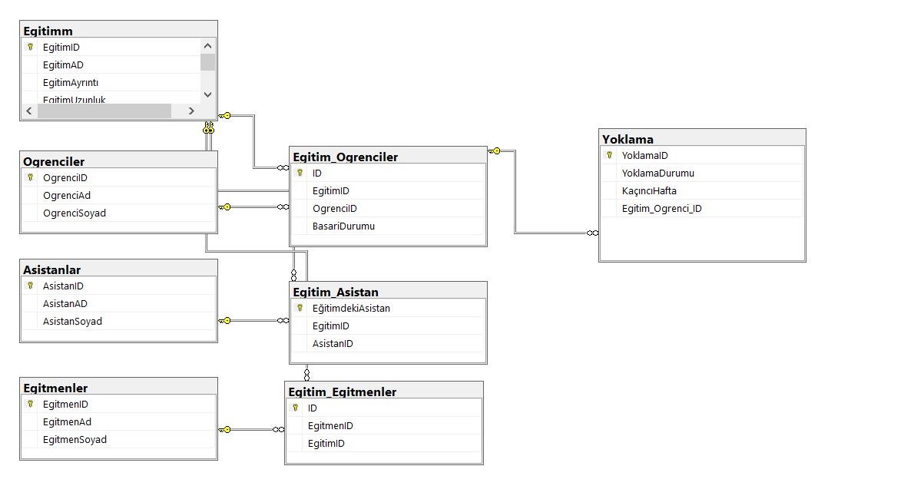

# UnluCo .net bootcamp 3.Hafta Ödevi
--------------------------------------------------------------------

## Yapılanlar

* İstenilen şekilde PatikaDevDB oluşturulmuş tablolar arası ilişkiler ve tipleri özenle seçilmiştir.

* İnstead of trigger yapısı kullanılarak yoklama tablosuna kayıt girildiğinde trigger sayesinde eğitim tablosundan eğitimin kaç hafta olduğuna bakılıp ona göre başaru durumuna ekleme yapılmaktadır. 

* Öğrenci id'si ve Eğitim id'Sİ sp'ye gönderilmektedir. O sp de öncelikle o id'ye sahip kişi eğitimde bunun kontrolü yapılmaktadır. Eğer eğitimde ise Eğitim süreleri çakışıyor mu diye kontrol yapılmaktadır. Eğer şuanda eğitimde değilse direkt kayıt yapılmaktadır.

* Öğrencilerin isim soyisim katıldıkları eğitim eğitim ayrıntısı uzunluğu ve başarı durumlarını gösteren ve group by kullanılan bir wievdir.